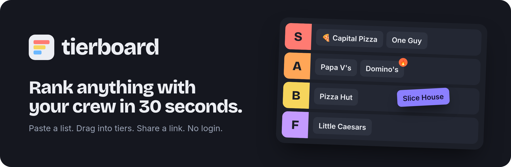
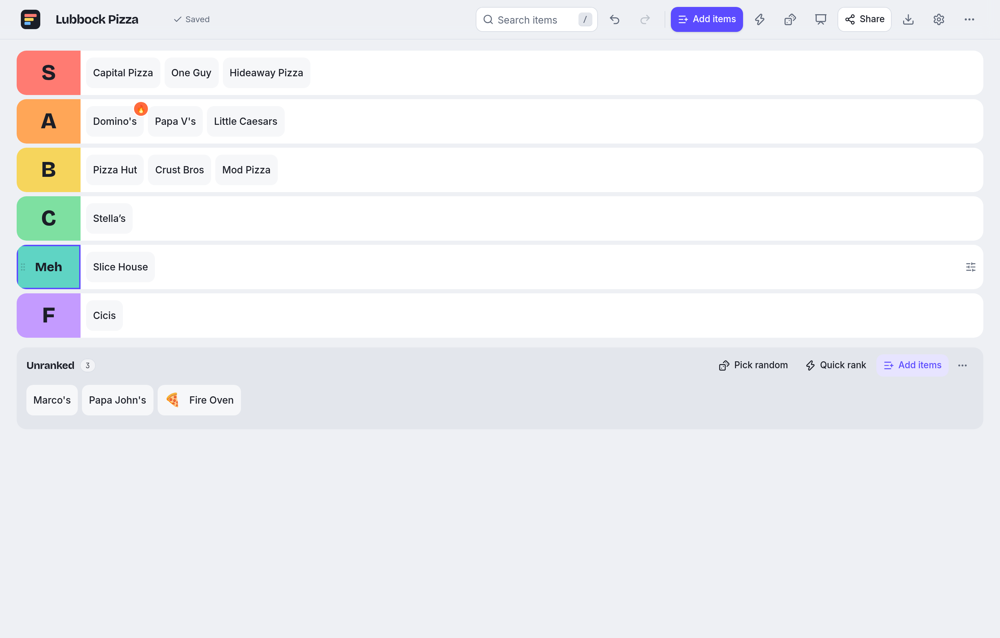
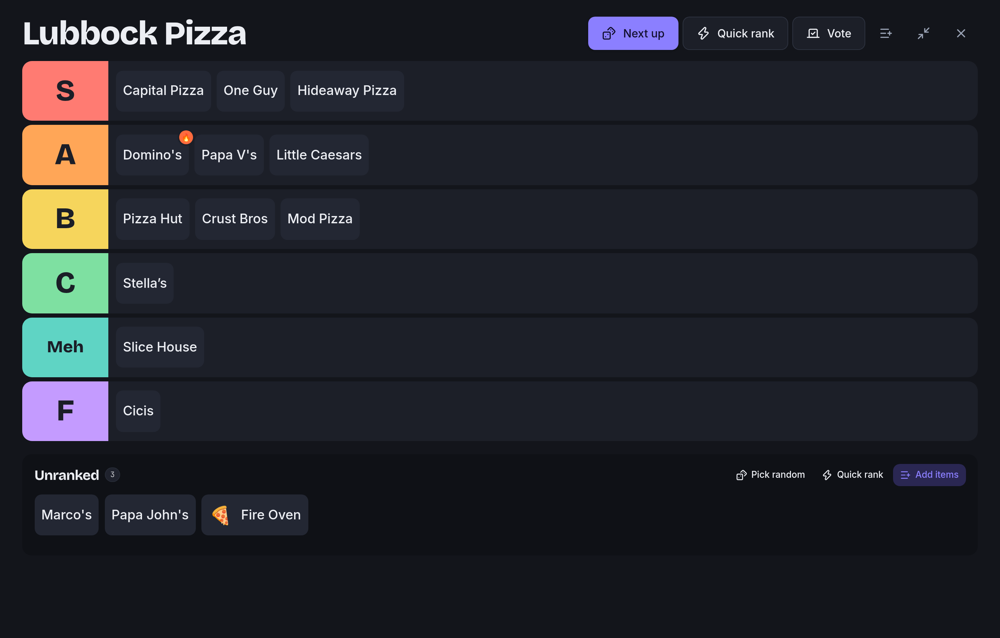
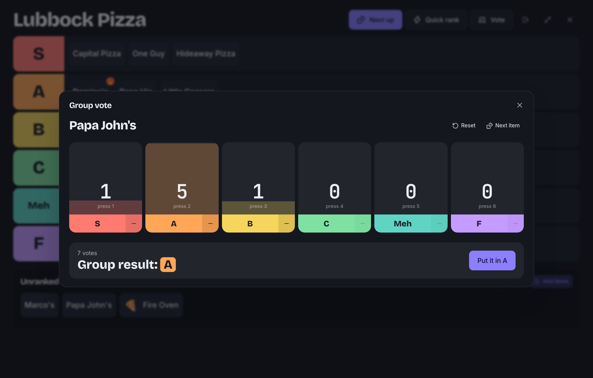
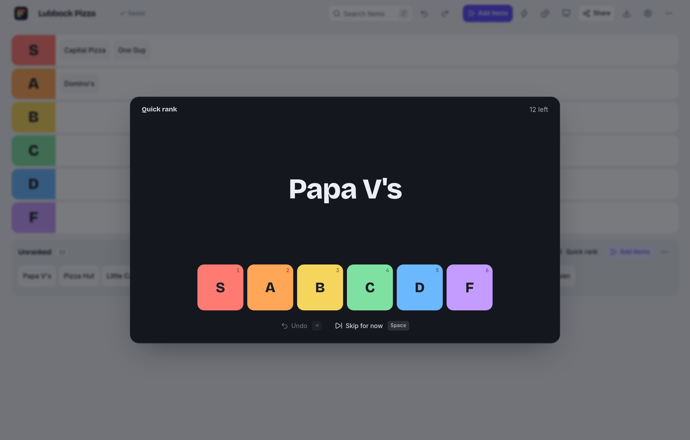
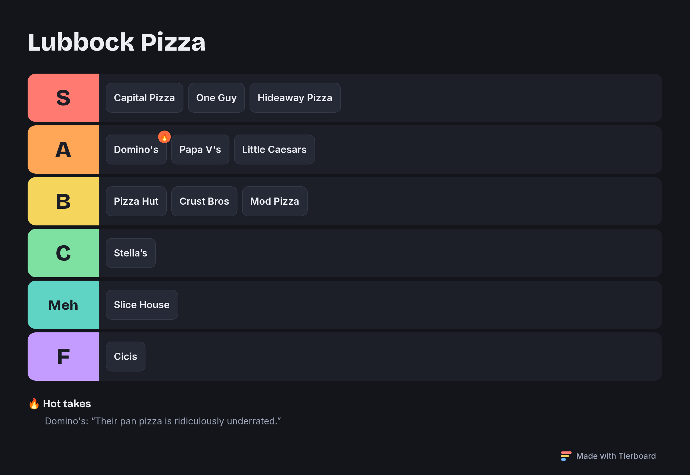
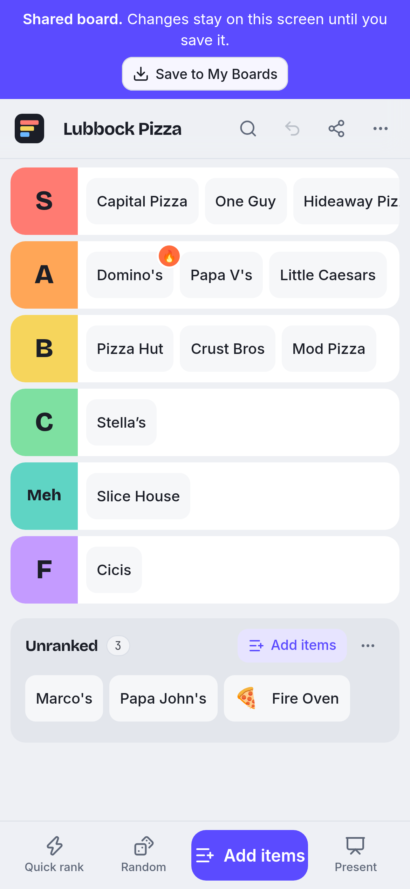
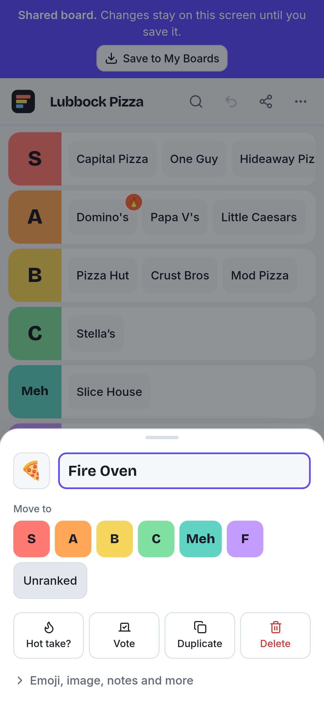
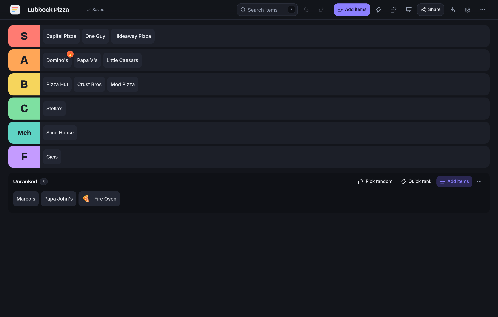

<p align="center">
  
</p>

<p align="center">
  <b>A fast, delightful tier-list app for groups.</b><br>
  Paste a list, drag it into tiers, share a link. Free, no login, runs entirely in your browser.
</p>

<p align="center">
  <a href="https://jameskbb.github.io/tierboard/"><b>Open Tierboard →</b></a>
  &nbsp;·&nbsp;
  <a href="#features">Features</a>
  &nbsp;·&nbsp;
  <a href="#development">Development</a>
  &nbsp;·&nbsp;
  <a href="docs/ARCHITECTURE.md">Architecture</a>
</p>

<p align="center">
  <a href="https://github.com/jameskbb/tierboard/actions/workflows/deploy.yml"></a>
  
  
</p>

<p align="center">
  
</p>

## Why

Someone at lunch says _"let's rank every pizza place in town."_ Tierboard is built so the person with the
laptop can open it, type a title, paste fifteen names and start dragging before the conversation moves
on. Everything else, from voting and presentation mode to comparison mode and PNG export, stays a
keystroke away without getting in that path.

## Features

**Ranking**

- **Paste a whole list at once.** Newline or comma separated, with list markers stripped and duplicates caught. `🍕 Capital Pizza` picks up the emoji, and `Name | subtitle` sets a subtitle.
- **Drag and drop that feels right.** Move between and within tiers, reorder tiers, long-press to drag on touch screens without breaking scrolling.
- **You never have to drag.** Tap an item and pick a tier, press `1`–`9` on a focused item, or run **Quick Rank** through the list with number keys.
- **Real undo and redo** for every change: `⌘/Ctrl Z`, `⌘/Ctrl ⇧ Z`.
- **Rich items**: emoji, image by URL or upload (stored in IndexedDB), subtitle, notes, link, accent color.
- **Tiers your way**: rename, recolor, add, duplicate, reorder and delete (items go back to Unranked by default). Presets include _GOAT → Trash_, _Must Have → Skip_ and _Love → Hate_.

**Around one screen**

- **Presentation mode** (`F`): big type on a dark stage, fullscreen, still fully draggable.
- **Next up** (`R`): a quick selector spin lands on a random unranked item, which you can rank on the spot.
- **Group vote**: tap `+1` per called-out vote, see _Group result: A_, apply it in one click. There's also a thumbs up/down vote.
- **Compare two at a time**: answer "which is better?" and get a suggested tier split you can adjust.
- **Random debate**, **tie breaker**, **🔥 hot takes** with notes, and a **stats** panel.

**Sharing and export**

- **Share links** carry the whole board in the URL hash, compressed. Nothing is uploaded. The recipient gets a temporary copy until they choose _Save to My Boards_.
- **PNG export** from a dedicated renderer at standard or high resolution, with **copy image** for Slack, Teams and Discord.
- **JSON** (versioned, migratable) and **CSV** export, plus import from CSV or plain text.

**Everything else**

- Autosave, multiple boards, templates, light, dark and system themes, and five board themes (Classic, Neon, Minimal, Retro, Arcade).
- `⌘/Ctrl K` command palette, `/` instant search, `?` shortcut sheet.
- Built for phones: one scrollable line per tier, a tap-to-rank sheet and a thumb-reach action bar.
- Accessible: keyboard-only ranking, screen-reader drag announcements, visible focus, reduced motion.

<table>
  <tr>
    <td width="50%"><br><sub>Presentation mode</sub></td>
    <td width="50%"><br><sub>Group vote</sub></td>
  </tr>
  <tr>
    <td width="50%"><br><sub>Quick Rank with number keys</sub></td>
    <td width="50%"><br><sub>Exported PNG</sub></td>
  </tr>
</table>

<p align="center">
  
  &nbsp;
  
  &nbsp;
  
</p>

## Development

Requires Node 22+.

```bash
npm install
npm run dev        # http://localhost:5173
```

| Command             | What it does                  |
| ------------------- | ----------------------------- |
| `npm run dev`       | Start the dev server          |
| `npm run build`     | Production build into `dist/` |
| `npm run preview`   | Serve the production build    |
| `npm test`          | Run the Vitest suite          |
| `npm run typecheck` | Strict TypeScript check       |
| `npm run lint`      | ESLint                        |
| `npm run format`    | Prettier                      |
| `npm run check`     | All of the above, like CI     |

## Deployment

Pushing to `main` runs [`.github/workflows/deploy.yml`](.github/workflows/deploy.yml): install, type check,
lint, test, build, deploy to GitHub Pages. Pull requests run the same checks without deploying.

One-time setup: in the repository, go to **Settings → Pages → Build and deployment** and set **Source** to
**GitHub Actions**.

The build sets `BASE_PATH=/<repo-name>/`, so the site works at `https://<user>.github.io/<repo>/`. Routing
uses the URL hash (`#/b/…`, `#/s/…`), so any static host works without rewrite rules.

## Tech stack

React 19, TypeScript (strict), Vite, Tailwind CSS v4, dnd-kit, Lucide, zustand, idb-keyval and Vitest.
There is no backend and no analytics.

## Architecture

```
src/
  models/        Board types, schema version and migrations
  features/
    ranking/     Pure board operations, presets, pairwise comparison, stats
    history/     Snapshot undo/redo
    persistence/ BoardRepository (localStorage), image store (IndexedDB), autosave
    sharing/     Share codec (JSON → deflate → base64url) and ShareTransport
    exporting/   JSON/CSV files and the canvas PNG renderer
    importing/   Bulk-entry parsing and duplicate detection
    voting/      Vote events, tallies and the VoteChannel seam
    templates/   Starter boards
  stores/        zustand stores: open board + history, UI state, preferences
  components/    board, tiers, items, dialogs, layout, ui primitives
  pages/         Home, saved board, shared board
```

Every change goes through `useBoardStore.apply(op)`, where `op` is a pure function from `features/ranking/boardOps.ts`.
That single path gives complete undo/redo, debounced autosave and easy tests. Persistence, sharing and voting
each sit behind a small interface (`BoardRepository`, `ShareTransport`, `VoteChannel`), so a realtime backend
can be added later without touching the UI. See [docs/ARCHITECTURE.md](docs/ARCHITECTURE.md).

## Contributing

Issues and pull requests are welcome.

1. Fork the repo and create a branch.
2. `npm install && npm run dev`
3. Keep board logic in pure functions with tests next to them (`*.test.ts`).
4. Run `npm run check` before opening a PR.

Tests focus on behavior that would hurt to break: serialization, migrations, moves, tier deletion,
undo/redo, bulk parsing and duplicates.

## Roadmap

- [ ] **Live rooms**: `…/room/PIZZA`, where everyone votes from their phone and the board updates live (see [architecture](docs/ARCHITECTURE.md#future-live-rooms))
- [ ] Short share links through an optional backend
- [ ] Image search for items
- [ ] Installable PWA with offline support
- [ ] More board themes and export layouts

## License

[MIT](LICENSE)
